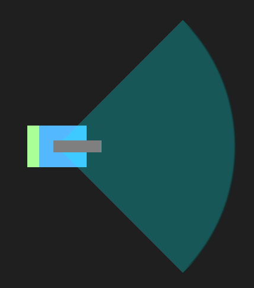

We have already set up a basic `Robot` class that all robots will subclass. We'll discuss the basics here and then show you where to find the full documentation.

Each robot has a body, gun and scanner. The body can move forward, move backward, turn left, and turn right. The robot's whole body is vulnerable to bullets shot by the enemies gun so it is usually best to keep moving!

The gun rotates when the body rotates but can also be rotated independently (so that it is not aimed directly forward).

The scanner is aimed in the same direction as the gun. It has a 90 degree angle field of view and a scanning distance of 150 pts (represented by colored arc). The scanner lights up when an enemy is scanned.

#Run loop

Each robot has a `run()` method that gets called continually. This will be the entry point for your robot's AI and will keep it ticking as the match progresses. The robots run a bit differently than you are used to. The code execution stops at each line until it's execution is finished. Callbacks are received immediately and can respond in realtime. Once the execution of a callback is finished, it will return to it's last place in the run loop.

#Robot callbacks

Your robot will rely on callbacks to get updates on current game information. You should override each of these to receive the callbacks and decide what to do next. These methods will be the arrows in your robot AI's state machine diagram.

##scannedRobot(robot: Robot!, atPosition position: CGPoint)

`scannedRobot` gets called whenever an enemy enters your robot's scanner. The position of the enemy robot is passed in through the parameter `position`.

##gotHit()

`gotHit` notifies your robot that it was just hit by an enemy bullet. It is probably a good idea to get moving when you get this callback!

##hitWall(hitDirection: RobotWallHitDirection, hitAngle: CGFloat)

`hitWall` let's your robot know it just hit a wall at the edge of the battlefield. It's good practice to move away from the wall so that you do not get blocked in.

##bulletHitEnemy(bullet: Bullet!)

`bulletHitEnemy` is called when you successfully hit the enemy robot. You might want to use this opportunity to fire another quick shot!

#Robot actions

You can call `moveAhead(distance: Int)`, `moveBack(distance: Int)`, `shoot()`, `turnGunLeft(degrees: Int)`, `turnGunLeft(degrees: Int)`, `turnRobotLeft(degrees: Int)`, and `turnRobotRight(degrees: Int)` from your robot class to control your robot.

`cancelActiveAction()` should be used in callbacks to immediately stop the current action. If you do not call this, the current action will continue until it is finished. This means if you get hit at the beginning of a `moveAhead(100)` action and `cancelActiveAction()` is not called in the `gotHit` callback, the robot will continue to move until it reaches it's destination. Execution of the `gotHit` callback will start once it's last move is done. Starting `gotHit` with `cancelActiveAction()` will allow it's execution to begin immediately.

#Information Retrieval

To make critical decisions it's important to have as much information as possible.

##Robot information

You have access to `hitPoints()`, `robotBodySize()`, `position()`, `gunHeadingDirection()` and `headingDirection()`.

###angleBetweenHeadingDirectionAndWorldPosition(position: CGPoint) -> CGFloat

`angleBetweenHeadingDirectionAndWorldPosition` returns the angle between the heading direction of the robot and an arbitrary point. Use this information to turn the robot in the direction / opposite direction of a detected object.

###angleBetweenGunHeadingDirectionAndWorldPosition(position: CGPoint) -> CGFloat

`angleBetweenGunHeadingDirectionAndWorldPosition` returns the angle between the heading direction of the gun of the robot and an arbitrary point. Use this information to turn the gun of the robot in the direction / opposite direction of a detected object.

##Simulation information

`currentTimestamp()` use this to mark information as stale after a certain time has passed. `arenaDimensions()` use this to calculate your robot's relative position in the game world.

#Getting started

To get started, download the [Robot Wars project](https://github.com/MakeSchool/RobotWar-Swift/archive/master.zip) and extract it's contents. In it, you will find a SpriteBuilder project containing a Robot Wars and a `docs/` folder that contains an html file detailing the full `Robot` class.
